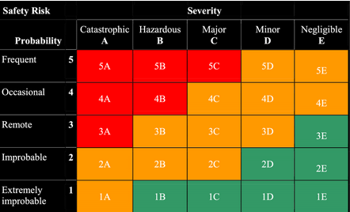
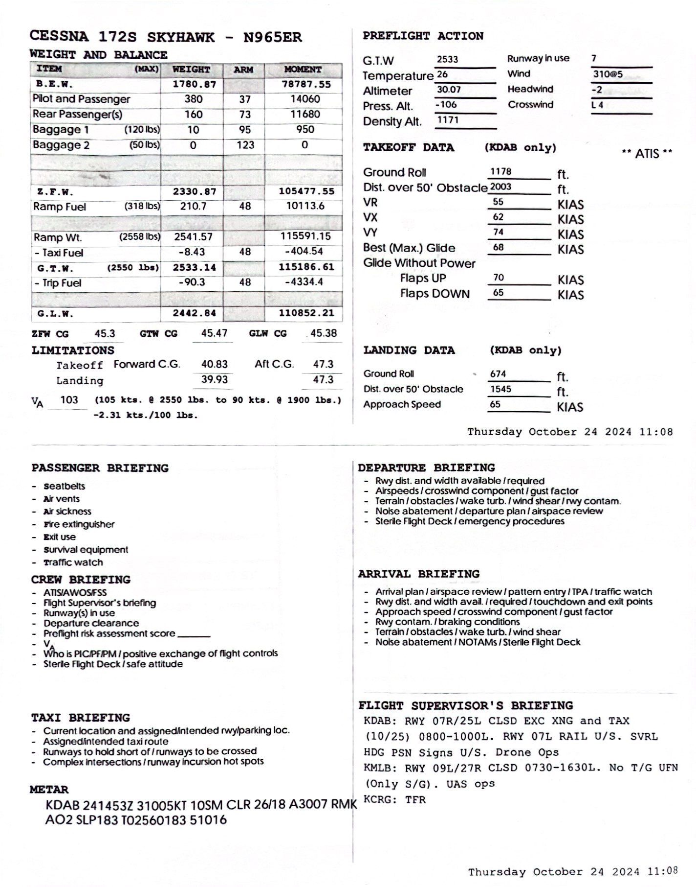
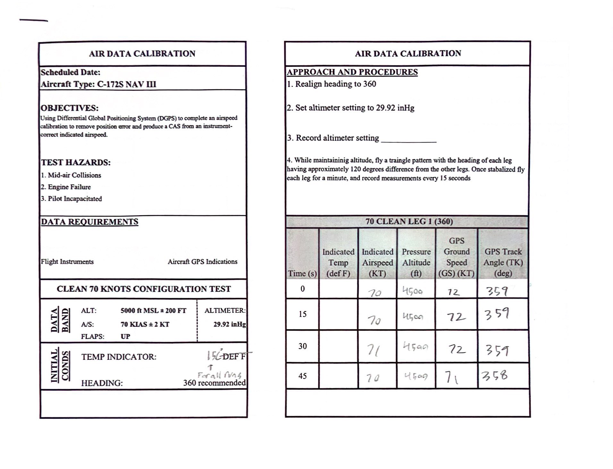
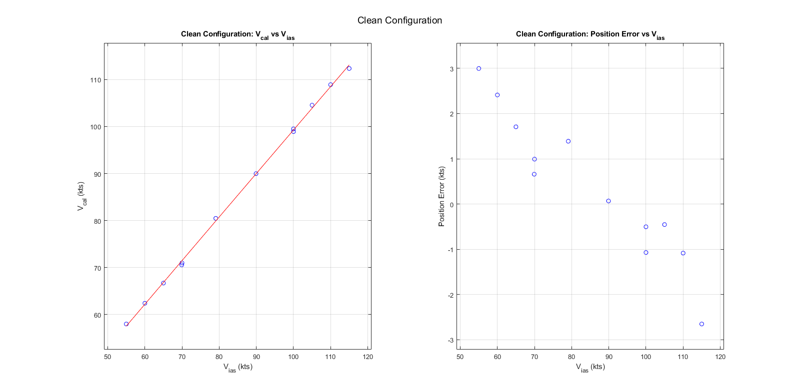
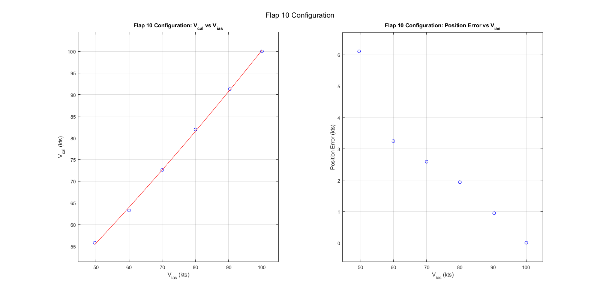
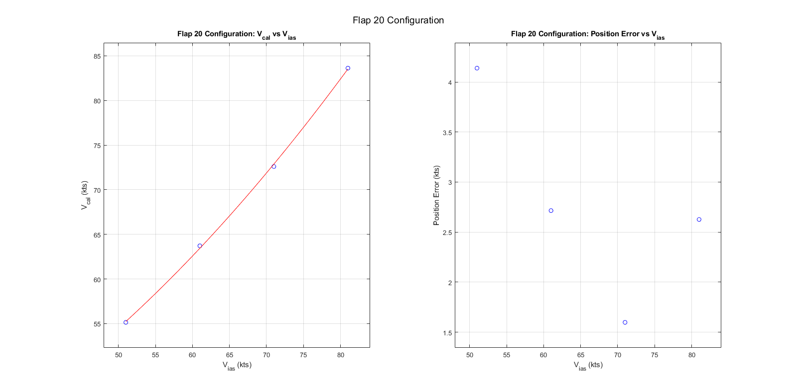
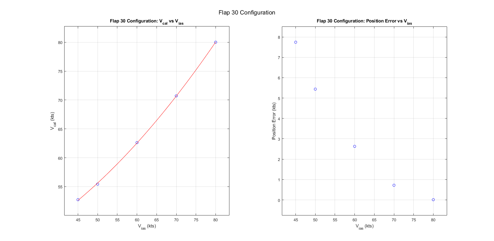
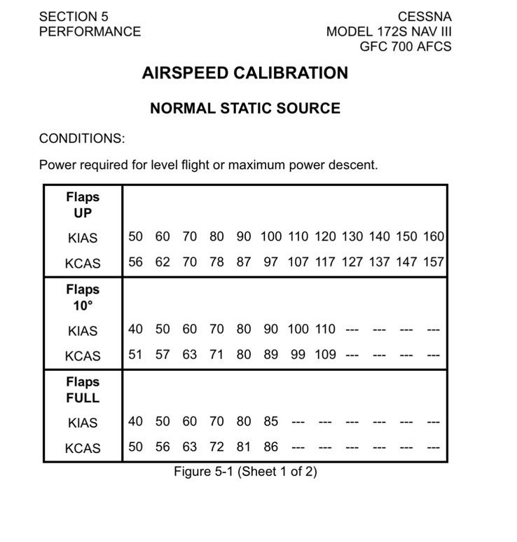

# Flight-Test-Course
The following repository contains the data and code developed for analysis of each respective flight test that was conducted through out the course and the project of the course aswell.

Risks & Mitigation

## Associated Risks: ##
These are the general risk assessment that was done for all flights.

Probability | Severity | Event | Safety Risk
| :---: | :---:  | :---:  | :---:
Emxtremely Improbable  | Catastrophic | Midair Collision  |  1A
Remote  | Hazardous | Engine Failure  |  3B
Improbable  | Catastrophic | Pilot Incapacitation  |  2A
Remote  | Hazardous | Bird Strike  |  3A

## Risk Mitigation ##

1. Midair Collisions
    1.  Dedicate 1 engineer to searching for other aircraft during tests, and frequently monitor ADSB (All Riddle Cessna’s contain Mode S Transponders) during testing and regular flight
    2. Once stabilized Pilot will announce to others on training area frequency of location, altitude, and intentions before each run (a run includes all 3 legs of a test)
    3. Schedule a flight for an off-peak hour as to reduce the chance of encountering another aircraft in a training area
    4. Efficient crew coordination and communication based off established procedures
              
2. Engine Failure
   1.  Embry Riddle’s part145 repair facility certification which requires many specializations, FAA inspections, and 2 people to write off an aircraft after maintenance has been performed on it
   2.  Perform Test at higher altitudes (5kft-8kft) to allow for a further glide distance and more time to make decision during the emergency
   3.  In the training area perform tests near fields that have enough room for an emergency landing
   4.  Agree on a predetermined airport to glide (for example if testing at bithlo training area the nearest airport would be Space Coast Regional Airport:TIX )
   5.  Pilot should stay in command whilst the engineer besides the pilot reads to him the emergency checklist for the occurring failure from the pilot operating handbook

3. Pilot Incapacitation
   1. Immediately Declare an emergency to ATC
   2. Just in case this scenario occurs the engineer up front should be the one most versed with the aircraft or that who knows how to manage the radio to talk to atc
   3. The pilot should have some fatigue management procedures in place like proper amount of rest, gaps in-between flights, and workload distribution in the cockpit

4. Bird Strike
   1. KDAB Airport employs cannons to scare away the birds
   2. Fly at altitudes greater than 2000ft AGL to avoid encountering birds
   3. Avoid training areas that contain bird farms

## Conducted Flight Tests:

 1. Airspeed Calibration

## Objective: ##

Determine airspeed calibration for the C172S-G1000 using the Global Positioning System Method.  
 
## Flight Test Briefing #

## Flight Test Card ##

## Results ##

## Analysis ##

Using Cessna's Pilot Operating Handbook (POH) as a reference for our test, it can be seen that there are certain trends that the experimental data must follow. Position errors should be larger at lower speeds than at higher speeds, showing a negative slope. At higher speeds, the largest position error obtained should be within a magnitude of 3 knots on average for Clean Configuration and 1 knot for Flaps 10 and Full. The largest position error should be at the 40/50 knots mark.

Looking at the graphs provided in the results section, we can see that the stated trends from the POH are met. There is a negative trend in all the graphs except for one outlier in the flaps 20 graph where the position error increases at the end. The magnitude of the position error also fits the trend for the clean configuration, though this is not true for the others.

Looking at the clean configuration position error, all the errors are within ±3 knots, which aligns with the POH. However, for the flaps 10 and full configuration, the majority of the position error is not within ±1 knot. This discrepancy could be attributed to several factors. Significantly less data was gathered for flaps 10 and full compared to clean configuration. Additionally, the flights were conducted on different days and times. The data was collected by 6 different groups from the class based on their assigned configuration and airspeeds. Time constraints existed due to aircraft being reserved for student pilots, making it complicated to gather the quantity of data necessary for a thorough analysis.

Better coordination among the 6 groups could have allowed for more comprehensive data collection. The group testing flaps 10 gathered 6 data points, while the flaps 20 group only gathered 4 data points. This disparity in data points could have been avoided with better planning.

## Conclusion ##

In conclusion, the position error analysis revealed mixed adherence to expected trends from the POH. While the clean configuration data closely matched the handbook's specifications with errors within ±3 knots and appropriate negative slope trends, the flapped configurations showed greater deviations than expected. These discrepancies can largely be attributed to limitations in the data collection process, including time constraints, varied testing conditions, and uneven distribution of data points across different configurations. Future studies would benefit from a more coordinated approach among testing groups, and a larger sample size for each configuration. Despite these limitations, the analysis provides valuable insights into the aircraft's position error characteristics and highlights important considerations for future flight testing procedures.

