# Flight-Test-Course
The following repository contains the data and code developed for analysis of each respective flight test that was conducted through out the course and the project of the course aswell.

<details>
<summary>Risks & Mitigation</summary>

## Associated Risks: ##
These are the general risk assessment that was done for all flights.

Probability | Severity | Event | Safety Risk
| :---: | :---:  | :---:  | :---:
Emxtremely Improbable  | Catastrophic | Midair Collision  |  1A
Remote  | Hazardous | Engine Failure  |  3B
Improbable  | Catastrophic | Pilot Incapacitation  |  2A
Remote  | Hazardous | Bird Strike  |  3A

## Risk Mitigation ##

1. Midair Collisions
    1.  Dedicate 1 engineer to searching for other aircraft during tests, and frequently monitor ADSB (All Riddle Cessna’s contain Mode S Transponders) during testing and regular flight
    2. Once stabilized Pilot will announce to others on training area frequency of location, altitude, and intentions before each run (a run includes all 3 legs of a test)
    3. Schedule a flight for an off-peak hour as to reduce the chance of encountering another aircraft in a training area
    4. Efficient crew coordination and communication based off established procedures
              
2. Engine Failure
   1.  Embry Riddle’s part145 repair facility certification which requires many specializations, FAA inspections, and 2 people to write off an aircraft after maintenance has been performed on it
   2.  Perform Test at higher altitudes (5kft-8kft) to allow for a further glide distance and more time to make decision during the emergency
   3.  In the training area perform tests near fields that have enough room for an emergency landing
   4.  Agree on a predetermined airport to glide (for example if testing at bithlo training area the nearest airport would be Space Coast Regional Airport:TIX )
   5.  Pilot should stay in command whilst the engineer besides the pilot reads to him the emergency checklist for the occurring failure from the pilot operating handbook

3. Pilot Incapacitation
   1. Immediately Declare an emergency to ATC
   2. Just in case this scenario occurs the engineer up front should be the one most versed with the aircraft or that who knows how to manage the radio to talk to atc
   3. The pilot should have some fatigue management procedures in place like proper amount of rest, gaps in-between flights, and workload distribution in the cockpit

4. Bird Strike
   1. KDAB Airport employs cannons to scare away the birds
   2. Fly at altitudes greater than 2000ft AGL to avoid encountering birds
   3. Avoid training areas that contain bird farms
</details>


## Conducted Flight Tests:

<details>
<summary> 1. Airspeed Calibration</summary>

## Objective: ##

Determine airspeed calibration for the C172S-G1000 using the Global Positioning System Method.  
 
## Flight Test Briefing #


## Flight Test Card ##


## Results ##


## Analysis ##


Using Cessna's Pilot Operating Handbook (POH) as a reference for our test, it can be seen that there are certain trends that the experimental data must follow. Position errors should be larger at lower speeds than at higher speeds, showing a negative slope. At higher speeds, the largest position error obtained should be within a magnitude of 3 knots on average for Clean Configuration and 1 knot for Flaps 10 and Full. The largest position error should be at the 40/50 knots mark.

Looking at the graphs provided in the results section, we can see that the stated trends from the POH are met. There is a negative trend in all the graphs except for one outlier in the flaps 20 graph where the position error increases at the end. The magnitude of the position error also fits the trend for the clean configuration, though this is not true for the others.

Looking at the clean configuration position error, all the errors are within ±3 knots, which aligns with the POH. However, for the flaps 10 and full configuration, the majority of the position error is not within ±1 knot. This discrepancy could be attributed to several factors. Significantly less data was gathered for flaps 10 and full compared to clean configuration. Additionally, the flights were conducted on different days and times. The data was collected by 6 different groups from the class based on their assigned configuration and airspeeds. Time constraints existed due to aircraft being reserved for student pilots, making it complicated to gather the quantity of data necessary for a thorough analysis.

Better coordination among the 6 groups could have allowed for more comprehensive data collection. The group testing flaps 10 gathered 6 data points, while the flaps 20 group only gathered 4 data points. This disparity in data points could have been avoided with better planning.

## Conclusion ##

In conclusion, the position error analysis revealed mixed adherence to expected trends from the POH. While the clean configuration data closely matched the handbook's specifications with errors within ±3 knots and appropriate negative slope trends, the flapped configurations showed greater deviations than expected. These discrepancies can largely be attributed to limitations in the data collection process, including time constraints, varied testing conditions, and uneven distribution of data points across different configurations. Future studies would benefit from a more coordinated approach among testing groups, and a larger sample size for each configuration. Despite these limitations, the analysis provides valuable insights into the aircraft's position error characteristics and highlights important considerations for future flight testing procedures.

</details>

<details>
<summary> 2. Stall Speed Determination</summary>

## Objective: ##
Determine stall speed (KIAS) for the C172S-G1000. 

## Flight Test Briefing #
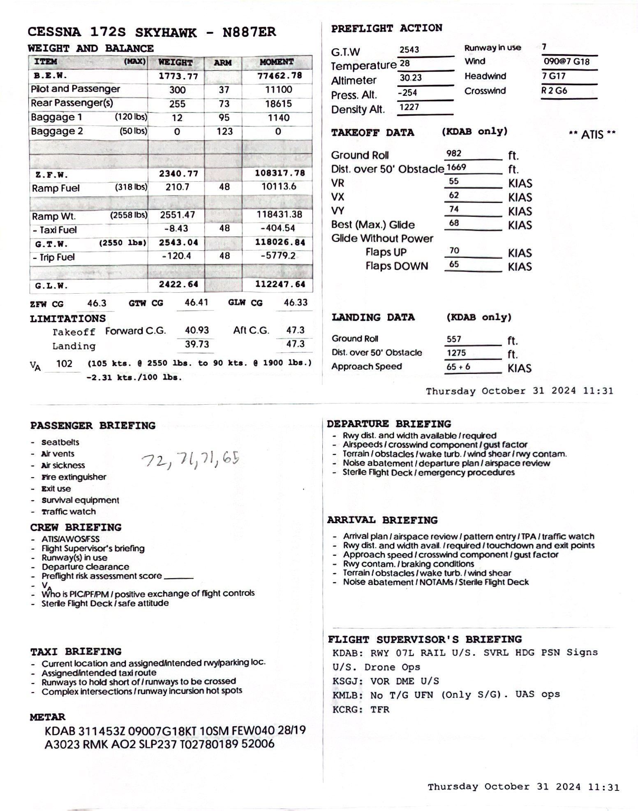

## Flight Test Card ##
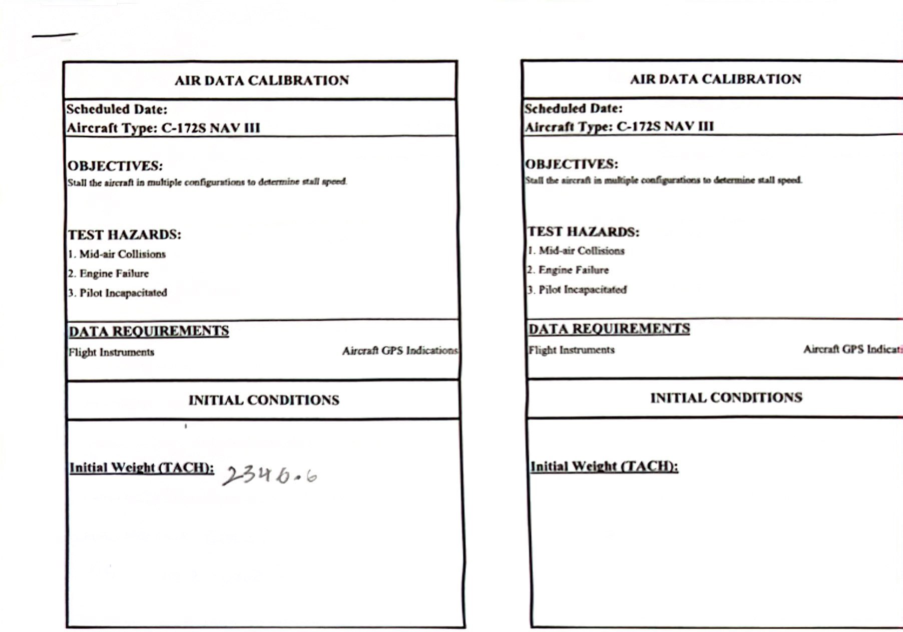
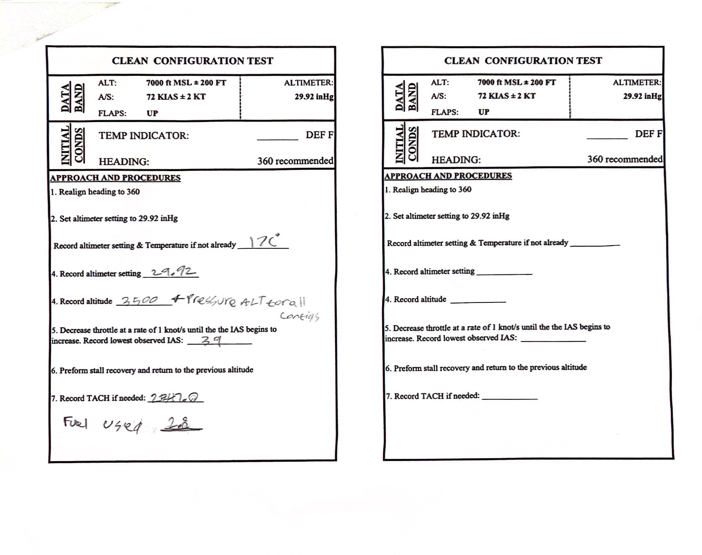

## Results ##
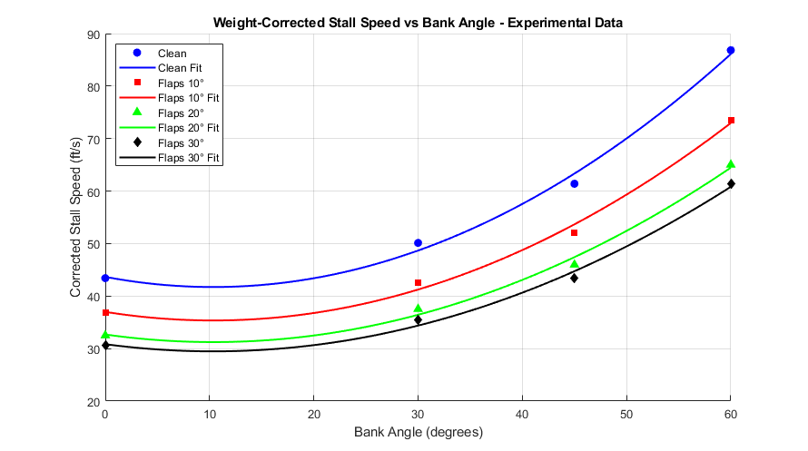

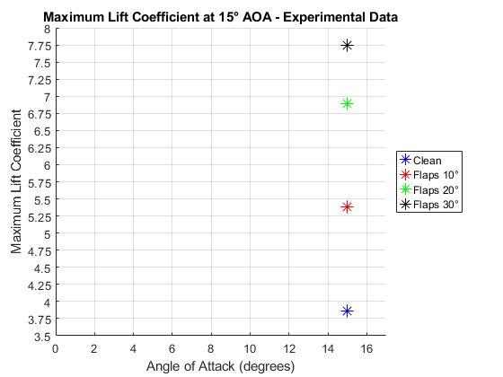
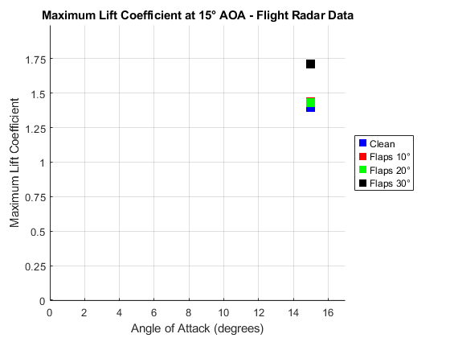
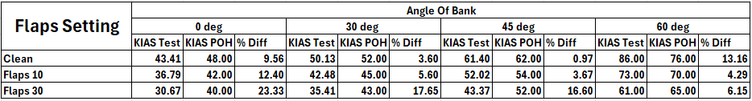

## Analysis ##
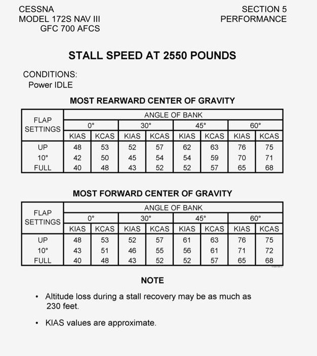
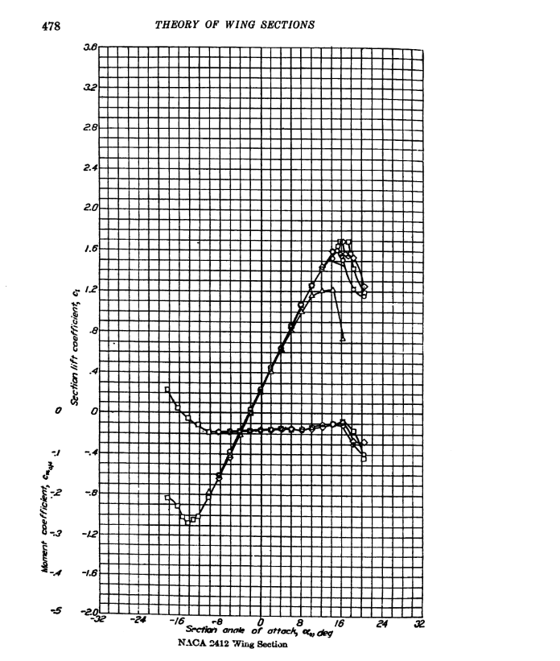

Looking at the Pilot Operating Handbook (POH) flight test data, there were some major discrepancies when comparing with Abbott & von Doenhoff's data and our experimental CLmax calculations. Starting with the POH stall speed with respect to bank angle, the majority of our experimental results showed percent differences greater than five percent when compared to the POH values. This suggests potential errors in our data collection, which can likely be attributed to wind conditions during testing. This conclusion is supported by our indicated airspeed (KIAS) being significantly lower than our Ground Speed (GS), a condition typically associated with a tailwind rather than a headwind.

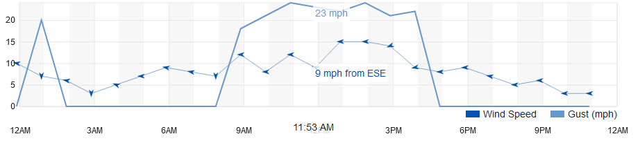

At the time of testing, winds were recorded at 9 mph (7.82 knots). When this wind correction was applied to the KIAS data collected from the experiment, the resulting values aligned much more closely with the POH values for stall speed with respect to bank angle. This correlation suggests that wind conditions, rather than pilot technique, were the primary source of error in our calculation

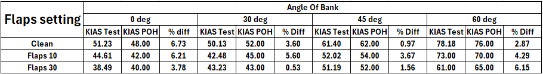

Regarding our CLmax calculations, using the raw KIAS data produced unrealistic CLmax values, while calculations based on Ground Speed yielded more reasonable results. The Cessna 172 uses a NACA 2412 airfoil, and according to Abbott & von Doenhoff's data, this airfoil should produce a CLmax of approximately 1.6. However, it should be noted that wind corrections were not incorporated into the code to determine if this would provide CLmax estimates closer to the expected value.

## Conclusion ##

In conclusion, the analysis of flight test data revealed significant impacts of wind conditions on our experimental results. The comparison between POH values and experimental data for stall speeds at various bank angles showed discrepancies greater than five percent, which were largely reconciled when wind corrections were applied to the KIAS measurements. This finding emphasizes the crucial role of environmental conditions in flight testing and the importance of proper wind corrections for accurate data analysis. Furthermore, the CLmax calculations demonstrated the significance of using appropriate speed measurements, as calculations using Ground Speed produced more realistic values compared to those using uncorrected KIAS. While our analysis identified wind as a possible primary source of experimental error, future testing could be improved by conducting experiments during more ideal weather conditions with minimal wind, preferably during early morning hours when atmospheric conditions are typically more stable. Additionally, incorporating wind corrections directly into the CLmax calculations and ensuring more comprehensive documentation of atmospheric conditions would enhance the accuracy of results. Despite these limitations, this investigation provides valuable insights into the relationship between theoretical aerodynamic predictions and real-world flight test data, while highlighting the importance of accounting for environmental factors in experimental aviation research.
</details>

<details>
    <summary>3. Takeoff Performance</summary>


## Overview
This project compares takeoff models using three approaches: 
1. A **Physics-Based Model** of the takeoff run.  
2. An **INS-Based Model** (Inertial Navigation System) created from phone accelerometer, gyroscope, and GPS data.  
3. A **GPS-Based Model** recorded using phone GPS data.  

The project involves tuning key parameters in the physics-based model to match the INS-based model and comparing results.

---

## Key Tasks
1. **Physics-Based Model**  
   A physics-based takeoff model was built in Simulink using engine performance as a basis. Key components include:  
   - Aircraft thrust and drag modeling  
   - Rolling friction (μ)  
   - Lift calculations based on $C_{L_0}$  

2. **INS-Based Model**  
   - Built using phone-based inertial sensors (accelerometer, gyroscope, and GPS).  
   - Calculates position, velocity, and acceleration during the takeoff roll.

3. **Model Tuning**  
   The following parameters were tuned in the physics-based model to match the INS model:  
   - Oswald Efficiency Factor (e)  
   - Friction Coefficient (μ)  
   - $C_{L_0}$ (Lift Coefficient at zero AOA)  
   - Additional drag factors (f)  

4. **Results**
<div style="text-align: center;">
  

*Takeoff and in-flight operations during data collection: Left - Pilots monitoring instrumentation for takeoff conditions; Right - Aerial view of Daytona Beach during flight testing.*


*Data collection setup using GFRecorder: The image shows one of the two iPads running the GFRecorder app, positioned carefully to maintain a consistent reference frame during flight. Despite our efforts, one iPad failed to collect GPS data, while the other reported erroneous latitude values corresponding to Antarctica. Fortunately, as a backup, we used a personal cell phone running the Phyphox app, ensuring reliable data collection in line with our contingency planning.*


Using the simulink the following images can be generated. First is a lat/long map of the GPS (top) and INS (bottom) method at Deland.


Then the groundspeed and distance down the runway could be calculated as seen below:


</div>

6. **Distance to 1.2 Vso**  
   The takeoff distance required to reach 1.2 times the stall speed $V_{SO}$
 is computed.  
   - Daytona: Between **900 ft and 1200 ft**.  
   - Deland: Similar range.  

---

## Test Locations and Results
Data for the takeoff runs was recorded at the following airports:  
- **Daytona Beach Airport**: Two clean runs recorded.  
- **Deland Airport**: Additional clean run recorded.  

| Parameter             | Daytona Run | Deland Run |
|-----------------------|-------------|------------|
| Friction Coefficient (μ) | 0.1         | 0.8        |
| Distance to 1.2 Vso   | 900–1200 ft | 900–1200 ft|  

---

## Models Overview (Dropdown Sections for Details)
<details>
<summary>INS-Based Model</summary>
The INS-based model uses data from a phone app that records accelerometer, gyroscope, and GPS signals.  
- **Tools Used**: Phone sensors and data fusion.  
- **Challenges**: Outlier corrections and sensor noise management.

Below is the INS system:


The **Angles Daytona** subsystem takes roll, pitch, and yaw rates frrom the gyroscope and converts them into roll, pitch, and yaw. It is important to note that the original yaw position is very important to insert into the integrator.

The **1D-INS (Daytona)** subsystem, shown below, performs two primary tasks:

1. **Distance Calculation in the Body Frame**:  
   The system integrates the \( N_x \) acceleration (forward acceleration in the body frame) to compute the distance traveled. This calculation only considers the **pitch** axis, excluding other rotational transformations. The **Ned to Body** subsystem does this task.  
   - To ensure accuracy at takeoff, \( N_x \) is zeroed out at the starting point by subtracting the initial \( N_x \) value from the entire \( N_x \) array. Subtracting Nz by the acceleration due to gravity is addtionally an important part of the process.

2. **Transformation to the NED Frame**:  
   The subsystem converts the body-frame accelerations (\( N_x, N_y, N_z \)) into the **NED (North-East-Down)** reference frame using a standard **321 rotation** (roll-pitch-yaw transformation).  
   - The transformed accelerations are integrated within their respective reference axes to obtain velocities and positions in the NED frame.

This approach ensures that both body-frame distance and global NED-frame positions are accurately computed.


</details>

<details>
<summary>GPS-Based Model</summary>
The GPS-based model uses position data logged by the phone's GPS sensors.  
- **Tools Used**: Phyphox App for data logging.  
- **Challenges**: Low time resolution and occasional GPS errors.

The GPS system can be seen below:


The **GPS (daytona)** subsystem is shown below. It uses 1D lookup tables that read from the Matlab workspace. It additionally converts lat/long to NED.


The **Absolute dist** subsystem can be seen below. This just adjusts to where you would like to start your takeoff.


The **groundspeed**  subsystem is only used as alternative method to calculate velocity in case the provided velocity the phone calculates includes the Z axis.
</details>

<details>
<summary>Physics-Based Simulink Model</summary>
The Simulink model uses equations of motion for takeoff and landing with engine performance inputs.  
- Includes rolling friction, lift, drag, and thrust forces.  
- Tuning parameters include e, μ, $C_{L_0}$, and f.

The Physics-Based Submodel can be seen below:


The base **Engine Model** is very similiar to the one used in the power avaiable assignment. More details can be found there, the subsystem can be seen below:


The drag can be calculated with the following collections of blocks below. The **Cl Equation subsystem** is a $C_{L}$ =  $C_{L_0}$ + $C_{L_α}$ 


The **Drag & Friction** subsystem calculates induced drag, parasyte drag, and rolling friction.


Finally you can use the equations of motions to get position and velocity.


</details>


---
## Files Included
```text
📦Takeoff Performance
 ┣ Takeoff_Sim.slx
 ┣ initialize.m
 ┣ 📂Data
 ┃ ┣ 📂Daytona
 ┃ ┃ ┣ 📄Accelerometer.csv
 ┃ ┃ ┣ 📄Gyroscope.csv
 ┃ ┃ ┗ 📄Location.csv
 ┃ ┣ 📂Daytona
 ┃ ┃ ┣ 📄Accelerometer_deland.csv
 ┃ ┃ ┣ 📄Gyroscope_deland.csv
 ┃ ┗ ┗ 📄Location_deland.csv
 ┗ 📄README.md
```
---

## Instructions for Running the Simulink Model
1. Open `Takeoff_Sim_my_data.slx` in MATLAB Simulink.  
2. Run `initialize.m`
3. Select "Import Data" on Matlab HOME, then select Output type as "Numeric Matrix"
4. Adjust your parameters as need
5. Run Simulink Model


</details>

<details>
    <summary>4. Climb Performance</summary>
    
## Objective ##
Determine climb performance for the C172S-G1000 by measuring the direct rate of climb

## Flight Test Briefing ##
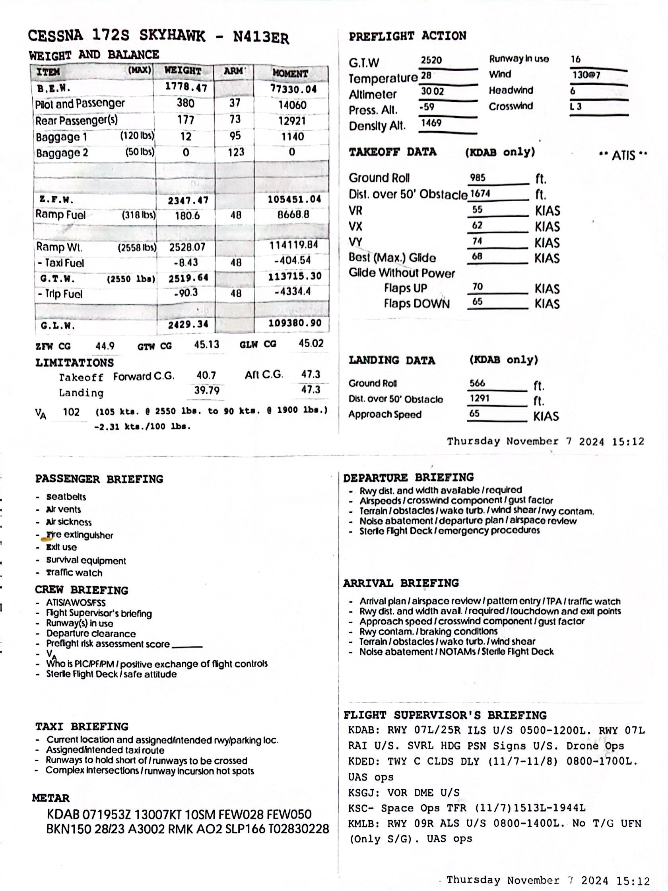

## Flight Test Card ##
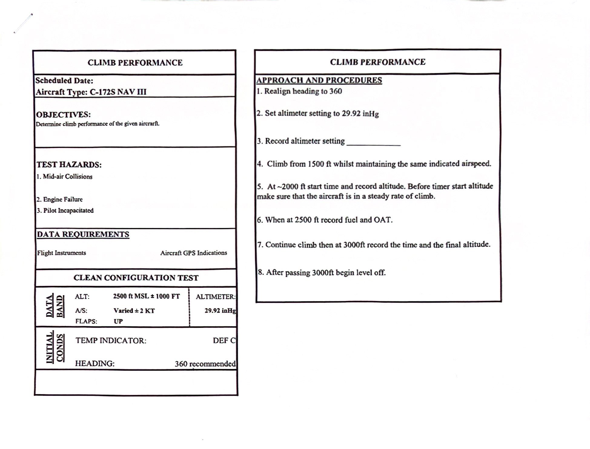
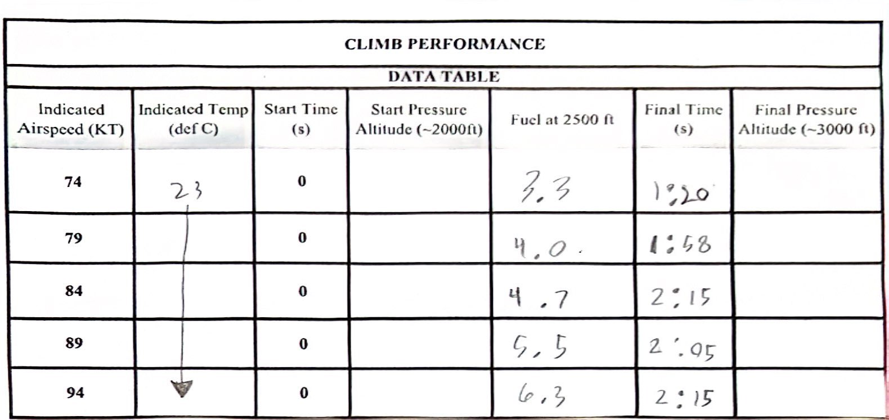
</details>
